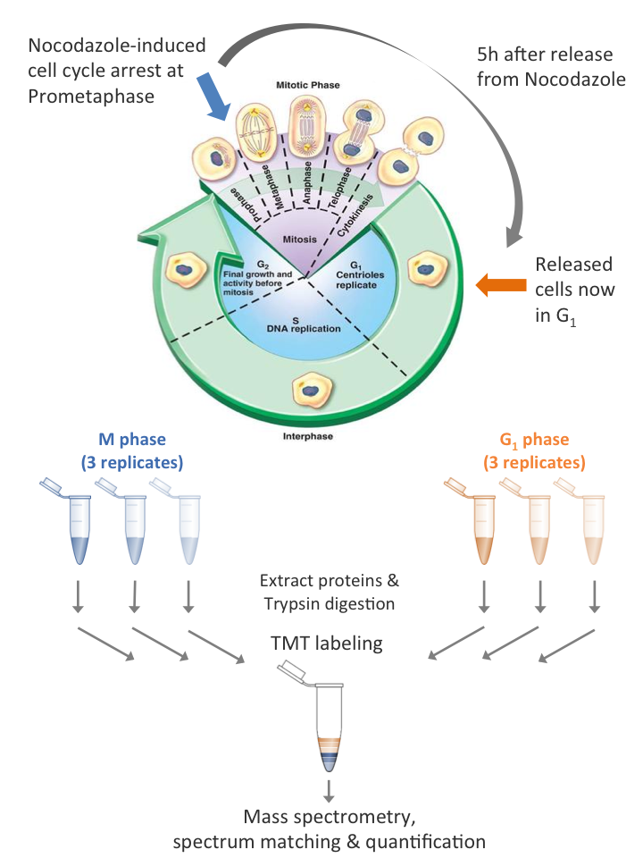

## 1. Introduction
In this practical you will analyse data from an experiment to examine proteins involved in the cell cycle (See diagram below). Cells from a human cell line were treated with Nocodazole to inhibit polymerisation of microtubules and block transition beyond the prometaphase stage of M-phase. Cells were then released from M-phase by withdrawing Nocodazole. Samples were taken in triplicate 0h and 5h after release to generate 3 x M-phase and 3 x G1-phase samples. In order to measure protein abundances, proteins were first digested to peptides with trypsin. The same quantity of peptides from each sample was then labelled using a TMT 6 plex. This allows all the samples to be combined into a single MS run to yield quantification over the same peptides in each sample. The peptide spectrum matching and quantification steps have already been completed and the peptide-level quantification is provided to you.



In this practical you will:

1. Aggregate the data to obtain protein-level quantification
2. Normalise the data
3. Perform a statistical test to identify changes in protein abundances
4. Perform a functional analysis to identify the perturbed biological processes

***

First we load the required libraries. If you get a message saying `Error in library(sds) : there is no package called ...`,

temporarily uncomment the neccessary lines to install the package
```{r}
#install.packages("tidyr")
#install.packages("dplyr")
#install.packages("reshape2")
#install.packages("ggplot2")

suppressMessages(library(tidyr))
suppressMessages(library(dplyr))
suppressMessages(library(reshape2))
suppressMessages(library(ggplot2))
```


## 2. Preparing the data

### 2a. Read in the peptide-level quantification
We'll start by reading the peptide-level quantification data into a dataframe. For the purposes of this practical, peptides which cannot be uniquely assigned to a single protein have been removed. Peptides which come from proteins in the [cRAP database](http://www.thegpm.org/crap/) of common proteomics contaminates, e.g keratin, have also been removed. The data is provided here in a tab-separated text file `"data/peptide_data.tsv"`. 

If we take a look at the colnames of the `peptide_quant` dataframe, we can see we have 9 columns. The first 3 columns describe the sequence of the peptide, the modifications which were detected and the protein which the peptide has been assigned to. The next 6 columns provide the quantification values for the 3 M-phase and 3 G1-phase samples.
```{r}
peptides_quant <- read.table("data/peptide_data.tsv", sep="\t", header=T)
print(colnames(peptides_quant))
print(head(peptides_quant, 5))
```

You'll notice that some of the quantification values are "NA".


*Q1. What do you think NA means in this context? Why do you think some of the quantification values are NA?*


If we re-order the dataframe we can see that some of the peptides have the same sequence but different modifications.
```{r}
duplicated_peptides <- unique(peptides_quant$Sequence[duplicated(peptides_quant$Sequence)]) # identify the duplicated peptides

peptides_quant %>%
  filter(Sequence %in% duplicated_peptides) %>% # filter to only duplicated peptides
  arrange(Sequence) %>% # sort by peptide sequence
  head(4) # view the "head" of the data
```

*Q2. Why might we have multiple quantification values for the same peptide but with different modifications?*


***

### 2b. Aggregating the quantification data to generate protein-level quantification

We can aggregate the quantification values across the multiple instances of the same peptide with difference modifications using the `dyplr` package

```{r}
peptides_quant_no_mods <- peptides_quant %>%
  select(-one_of(c("Modifications"))) %>% # exclude the Modifications column
  group_by(Sequence, master_protein) %>% # group by the Sequence and master_protein columns
  summarise_each(funs(sum(.))) %>% # aggregate the quantification values using the sum function
  data.frame() # convert back to a data.frame

print(head(peptides_quant_no_mods))
```

### 2c. Dealing with missing values

We still have peptides with missing values
```{r}
quant_columns <- c("M_1", "M_2", "M_3", "G1_1", "G1_2","G1_3")

missing_values_pre_agg <- peptides_quant  %>%
  select(one_of(quant_columns)) %>% # only select the quantification columns
  is.na() %>% # returns a matrix of booleans (TRUE, FALSE), where TRUE = values is NA
  sum() # TRUE=1, FALSE=0 so sum of booleans is the number of TRUEs

missing_values_post_agg <-peptides_quant_no_mods %>%
  select(one_of(quant_columns)) %>%
  is.na() %>% 
  sum()

cat(sprintf("Before aggegation, we had %i peptides with missing values, after aggregation we have %i peptides with missing values",
            missing_values_pre_agg, missing_values_post_agg))
```

For the peptides with missing values, we could impute the values but this is beyond the scope of this practical. For our purposes, we'll just remove any peptide with a missing value
```{r}
peptides_quant_no_mods_no_na <- peptides_quant_no_mods %>% na.omit()
```

Before we proceed with the aggregation to protein-level quantification, we should consider whether we need to perform any normalisation to the data.  The total peptide abundance in each column should be approximately the same. However, we can see below that this is not the case

### 2d. Normalisation
```{r}
pep_tots <- peptides_quant_no_mods_no_na %>%
  select(one_of(quant_columns)) %>%
  colSums()

print(pep_tots)
```


*Q3. Why should the total peptide abundance be approximately the same (see experimental design). Why could cause it to be different? What impact could this have on any downstream statistical analysis?*


Next we will normalise the peptide-level quantification to adjust for the differences in the total peptide abundance

```{r}
pep_tots_correction_factors <- pep_tots/mean(pep_tots) # make a correction factor using the total peptide abundance

peptides_quant_norm <- peptides_quant_no_mods_no_na

# the devide operation will work on each cell in the dataframe by column so we need to transform (t)
# the dataframe so the columns are the peptides and each row is a sample before performing the devide operation,
# then re-transform back to the initial layout
peptides_quant_norm[,quant_columns] <- t(t(peptides_quant_norm[,quant_columns])/pep_tots_correction_factors)
```

We can check that the total are now the same:
```{r}
norm_pep_tots <- peptides_quant_norm %>%
  select(one_of(quant_columns)) %>%
  colSums()

print(norm_pep_tots)
```

Plot the distribution of abundance values before and after normalisation allows us to see the impact of normalisation. Here we will create a small function to perform the plotting to save space from copying code. Note that we are plotting the logged abundance values. This is because the abundance values extend across 4-orders of magnitude are are not Gaussian (normal) distributed. However, they are approximately log-Gaussian distributed.
```{r}
plotPeptideAbundance <- function(peptide_data, title=""){

  p <- ggplot(suppressMessages(melt(peptide_data)), # we need to melt the dataframe to reformat it for ggplot
    aes(variable, log(value, 2))) + # after calling melt, the column "value" contains the quantification data
                                    # and "variable" describes the sample ID
    geom_boxplot() +
    xlab("") + ylab("Log2 Peptide Abundance") +
    theme_bw() +
    theme(text=element_text(size=20)) +
    ggtitle(title)

  print(p)
}

plotPeptideAbundance(peptides_quant_no_mods_no_na, "Pre-normalisation")
plotPeptideAbundance(peptides_quant_norm, "Post-normalisation")

```

Now we have a single quantification value for each peptide, we can aggregate across the different peptides for the same protein to obtain the protein-level quantification. Here we are using the median.


*Q4. Why do you think we are using the median here? What other mathematical operations could we use and what are the relative merits?*


```{r}
protein_quant <- peptides_quant_norm  %>%
  select(-one_of(c("Sequence"))) %>% # exclude the Sequence column
  group_by(master_protein) %>% # group by the master_protein column
  summarise_each(funs(median(.))) %>% # aggregate the quantification values using the median function
  data.frame() # converts back to a data.frame

rownames(protein_quant) <- protein_quant$master_protein # indexes dataframe with master_protein column
protein_quant$master_protein <- NULL # remove master_protein column

print(head(protein_quant))
```

***

## 3. Performing a statistical test to identify changes in protein abundance

Next we want to identify the proteins which have a statistically significant change in abundance between M and G1 phases. For the purposes of this practical, we will only consider frequentist statistics here. Formally, we set out a null hypothesis (H0) that the change in abundance for a protein is zero and test the alternative hypothesis (H1) that the change is greater than zero. For each protein we will conduct an independent statistical test. The important points to consider when choosing the appropriate statistical test are:

* We have independent samples from two populations and wish to test whether the difference in the mean of the two populations is non-zero
* The samples are not paired, e.g M-phase replicate 1 and G1-phase replicate 1 are not related samples
* We want to identify changes in both directions
* The protein abundances are not Gaussian (normal) distributed. However, they are approximately log-Gaussian distributed.

This is a very simple experimental design and we recommend that you use a student’s t-test for this practical. However, there are other statistical tests which would also be suitable. For example, if one was concerned about whether the protein abundances are truly approximately Guassian, a non-parametric test such as the Mann-Whitney U test or Wilcoxon rank-sum tests may be used depending on the exact experimental design. Alternatively, if the experimental design was more complicated and we wished to take into account cofounding factors, or investigate interactions between factors, we could use ANOVA or Linear Regression.


*Q5a. Should the t-test be one-tailed or two-tailed. Should you perform a paired t-test, a two-sample equal variance t-test or a two-sample unequal variance t-test?*


*Q5b. Do you need to perform any transformation on the data before conducting the t-test?*


*Q5c. What are the assumptions of the t-test and do these assumptions hold for this data? *


*Q5d. How low does the p-value have to be before you reject H0 (what’s your value for alpha)?*


*Q5e. What effect size do you think would be biologically relevant? Would a 2-fold increase/decrease in abundance be relevant? What about a 0.5-fold or a 0.1-fold increase/decrease*


We will log-transform the data before conducting the t-test. We will use `log2()` since base 2 is a more human-understandable scale than natural logarithms.

```{r}
protein_quant_log <- protein_quant
protein_quant_log[,quant_columns] <- log2(protein_quant_log[,quant_columns])
```

In order to perform the t-test on each row we will create a function which performs a t-test on a vector of six values (where 1-3 = group 1, 4-6 = group 2) and returns the p.value, the difference between the group means, and the 95% confidence interval for the difference.
```{r}
runSingleTTest <- function(quant_values){
  test_results <-t.test(quant_values[4:6],quant_values[1:3], paired=FALSE, alternative="two.sided", conf.int=TRUE,
                        var.equal = T)
  p.value <- test_results$p.value
  difference <- as.numeric(test_results$estimate[1] - test_results$estimate[2])
  ci <- as.numeric(test_results$conf.int)
  return(c(p.value, difference, ci))
}


TTest_results <- protein_quant_log

# apply the runSingleTTest function over each row ("MARGIN=1") for the quantification columns
# We need to transform (t) the values returned by apply to get the correct layout
TTest_results[c("p.value", "difference", "CI_diff_low", "CI_diff_high")] <- t(apply(
  TTest_results[,quant_columns], MARGIN=1, runSingleTTest))

```

### 3a. Accounting for multiple hypothesis test


*Q6. For your chosen level of alpha, how many proteins would you expect to have a significant change in abundance by chance (false positives; Type I errors) ?*


Since we have conducted multiple tests, we will get many false positives if we just use the uncorrected p-values. We have two options to deal with the multiple testing.

1. Control the Family-Wise Error Rate (FWER) so that the probability of getting even a single false positive equals our initial alpha
2. Control the False Discovery Rate (FDR) so that the percentage of false positives among the null hypotheses rejected is no greater than a chosen value

The first approach suffers from very low power since we are trying to avoid identifying even a single false positive across all the tests conducted. This stringently avoids false positives (type I errors) but leads to many false negatives (type II errors). The second approach is much more powerful since we are allowing a certain percentage of our rejected null hypothesis to be incorrect. Thus, the number of type I errors will increase, but the number of type II errors will decrease considerably. Which approach to take depends on the application.

Here, the downstream analysis will focus on groups of proteins with shared functionality, rather than specific proteins which have altered abundance. Therefore, we can accept a low percentage of false positives. We will calculate the FDR using the Benjamini-Hochberg method via the `p.adjust` function and reject the null hypothesis where the FDR < 0.01 (1%). This will mean approximately 1% of the rejected null hypothesis will be false positives but we will not know which ones.

```{r}
TTest_results$FDR <- p.adjust(TTest_results$p.value, method = "BH")

FDR_threshold <- 0.01
TTest_results$sig <- TTest_results$FDR < FDR_threshold
```

We can summarise how many proteins have a significant change in abundance using the `table` function
```{r}
table(TTest_results$sig)

```


*Q7 Can you add another command in the cell above to work out how many of the proteins have a significant increase in abundance and how many decrease?*


We can visualise the t-test results in a so-called "Volcano" plot (see below). In the second plot we add the 95% confidence intervals for the change in abundance. Many of the signficant changes are small. In fact, just 16/156 of the significant changes in abundance are greater than 2-fold (Note that we have log base 2 transformed the abundance data so a change in abundance of 1 on the log scale is a 2-fold change).

```{r}
cat("Tally of changes > 2-fold for proteins where null hypothesis rejected")
print(table(abs(TTest_results[TTest_results$sig==T,]$difference>1)))

p <- ggplot(TTest_results, aes(x=difference, y=-log(p.value,10), fill=sig)) +
  xlab("Change in abundance (G1 vs M)") + ylab("p-value (-log10)") +
  scale_fill_discrete(name="Signficant change\nin abundance") +
  theme_bw() +
  theme(text=element_text(size=20))
  
print(p + geom_point(pch=21, stroke=0.25, size=3))

p2 <- p + geom_errorbarh(aes(xmin=CI_diff_low, xmax=CI_diff_high, colour=sig)) +
  geom_point(pch=21, stroke=0.25, size=3) +
  scale_color_discrete(guide=F)

print(p2)
```
### 3b. Selecting the most relevant changes

Depending on how you answered Q6e, you may not be concerned that many of the changes are relatively small. However, it's reasonable to assume a very small change in abundance is unlikely to be biologically relevant. Therefore, it's beneficial to also threshold on the scale of the change, the so called "effect size". We could simply apply a threshold on the point estimate of the difference between the two populations. However, this would not take account of the confidence we have about the true difference between the two populations. For a more explanation of the pitfalls of thresholding on the point estimate, see the example at the bottom of this notebook.

For this reason, we will instead apply a threshold on the 95% confidence interval of the difference between the means. In the cell below we apply a filter that change is at least 1.5-fold

```{r}

# Function to find the minimum distance between the CI and zero
GetCIMinDiff <- function(row){
  
  if(sign(row[['CI_diff_low']]) != sign(row[['CI_diff_high']]) | # if low and high CI have diff. signs, or
     row[['CI_diff_high']]==0 | row[['CI_diff_low']] == 0){ # either is zero
    return(0) # then the CI overlaps zero
  }
  
  else{
    
    if(abs(row[['CI_diff_high']])<(abs(row[['CI_diff_low']]))){ # if abs. values of high CI is lower
      return(row[['CI_diff_high']]) # return the high CI
    }
    
    else{
      return(row[['CI_diff_low']]) # otherwise, return the low CI
    }
  }
}

# apply GetCIMinDiff to each protein 
TTest_results$abs_CI_diff <- apply(TTest_results, MARGIN=1, GetCIMinDiff) 

# 50% difference = 2^0.55
TTest_results$relevant_change <- abs(TTest_results$abs_CI_diff)> ((2^0.5)-1)

cat("Cross-tabulation of significant differences (columns) and differences where CI indicates difference > 25% (rows)\n")
print(table(TTest_results$relevant_change, TTest_results$sig))

```
So we can see that for 86/156 proteins with a significant change in abundance, the 95 % CI for the differece suggests the change is > 50%.

We can now make a new volcano plot to show which proteins are identified as having a statistically significant and biologically relevant change in abundance.
```{r}

p <- ggplot(TTest_results, aes(x=difference, y=-log(p.value,10), fill=(sig & relevant_change))) +
  xlab("Change in abundance (G1 vs M)") + ylab("-log10(p-value") +
  scale_fill_discrete(name="Significant &\nrelevant\nchange\nin abundance") +
  geom_errorbarh(aes(xmin=CI_diff_low, xmax=CI_diff_high, colour=(sig & relevant_change))) +
  geom_point(pch=21, stroke=0.25, size=3) +
  scale_color_discrete(guide=F) +
  theme_bw() +
  theme(text=element_text(size=20))

print(p)
```

***

## 4. Functional analysis of proteins with differential abundance

### 4a. What are the proteins

Now that we've identified the proteins which have a different abundance in G1-phase vs. M-phase, the next step is to investigate the functions for these proteins. First, let's add the protein names and descriptions

```{r}
human_proteins_ids_df <- read.csv(
  "data/human_protein_ids.tsv", sep="\t", header=F,
    colClasses=c("character", "character", "character", "NULL", "NULL"),
  col.names = c("UniprotID", "Name", "Description", NA, NA))

TTest_results_annotated <- merge(human_proteins_ids_df, TTest_results, by.x="UniprotID", by.y="row.names")

```

We can inspect the Descriptions for the proteins which have a significant decrease in abundance in G1 vs M
```{r}
TTest_results_annotated %>%
  filter(sig==T) %>% # significant changes
  filter(relevant_change==T) %>% # bioligically relevant changes
  filter(difference<0) %>% # decrease in abundance
  arrange(abs_CI_diff) %>% # sort by CI
  select(Name, Description, abs_CI_diff, FDR) %>% # select columns of interest
  head(20)
  
```
Can you see what functions some of these proteins might have based on their descriptions? As with most such analyses there will likely be some proteins you have heard of, but many more which you haven’t. After all, there are ~20,000 proteins in the human genome! It’s also very hard just by looking at the proteins which have changed to understand what shared functional pathways they may have in common. Many of the protein’s functions may not be obvious just from their description. Likewise, the sub-cellular localisation may not be obvious, and it could be that most of the proteins with altered abundance have the same localisation which would be an interesting observation in of itself. Even if you were a fountain of knowledge on human proteins, it’s difficult by eye to know if an observation if unexpected. For example, if you see 4 kinases which are all more abundant in G1, is this a relevant observation? To answer this, you would need to know how many kinases could have changed abundance in your experiment, from which you can estimate how many kinases you would expect to see by chance given the number of proteins with an altered abundance. In short, just looking at the protein descriptions will only get you so far. 

### 4b. Identifying over-representation of particular protein functions/localisations

Thankfully, the [Gene Ontology (GO) consortium](http://www.geneontology.org/) have defined a set of descriptions for genes and their protein products, split into 3 categories, Molecular Functions, Biological Processes and Cellular Localisations. These terms are hierarchical. For example as shown [here](https://www.ebi.ac.uk/QuickGO/term/GO:0003723), “RNA binding” is a child term of “Nucleic acid binding” and a parent term of e.g “RNA cap binding”. 

To better understand the biological relevance of the protein abundance changes between M and G1 phase, we can look for GO terms which are over-representated in the proteins with a significant change. A GO over-representated analysis involves asking whether a GO term is more frequent in a selected set of proteins (the “foreground”) relative to all the proteins which could have been selected (the “background”). As with any over-representation analysis, it’s important to consider what the “background” should be. 


*Q8. What do you the most suitable background would be for the GO term over-represenatation analysis?*


In this case, we could either perform
1. One test where the foreground is all proteins with a significant change in abundance, or
2. Two tests, one where the foreground is all proteins with a significant increase in abundance, and the other is proteins with a significant decrease in abundance. 


*Q9. Do you think it makes more sense to perform one or two tests for the GO term over-represenatation analysis?*


To make things easier for this practical, we will use [GORILLA](http://cbl-gorilla.cs.technion.ac.il/) here for it’s simplicity but note there are many better tools available.

First we'll save out lists of proteins which have increased or decreased abundance in G1 vs M, and the background set of proteins.
```{r}
background_proteins <- TTest_results_annotated$UniprotID

TTest_results_sig_relevant <- TTest_results_annotated %>%
  filter(sig==T) %>% # retains sig changes only
  filter(relevant_change==T) %>% # retain relevant changes only
  select(UniprotID, difference, abs_CI_diff) # select required columns

table(TTest_results_sig_relevant$difference>0)

# identify proteins with increase in abundance
up_proteins <- TTest_results_sig_relevant %>%
  filter(difference>0) %>% # positive change in abundance
  select(UniprotID)

dw_proteins <- TTest_results_sig_relevant %>%
  filter(difference<0) %>%
  select(UniprotID)  
  
write(unlist(up_proteins), "data/foreground_up.tsv")
write(unlist(dw_proteins), "data/foreground_dw.tsv")
write(background_proteins, "data/background.tsv")
```

http://cbl-gorilla.cs.technion.ac.il/

To use [GORILLA](http://cbl-gorilla.cs.technion.ac.il/):

* Step 1. Select “Homo sapiens” for the organism
* Step 2: Select “Two unranked lists of genes (target and background lists)”
* Step 3: Below the “Target Set” box, click browse and upload your foreground data, e.g "foreground_dw.tsv". Below the "Background set box”,  click browse and upload your background data.
* Step 4: Select "All" ontologies

Leave the advanced parameters as they are and click “Search Enriched GO terms”

The GORILLA output is split into three sections for “Processes”, “Function” and “Component”. For each section there is graph depiciting the over-representated terms and their relationship to one another. Below this there is a table detailing the GO terms which are over-represented. Each GO terms is associated with a p-value for the over-representation and an estimation of the False Discovery Rate (FDR). For this practical, only consider any GO term over-representation where the FDR < 0.01 (1E-2)


*Q10. What GO terms are over-represented in the proteins with a change in abundance between M and G1 phase?*


*Q11. Why might there only be over-represented GO terms in the proteins with decreased abundance?*


*Q12. Why do you think there are so many related GO terms identified*


*Q13. From inspecting the over-represented GO terms, can you say whether the Nocodazole has had the desired effect?*


*Q14. What other analyses could you perform to better understand the function of these proteins?*

***

**You've now completed the practical - Well done!**

If you want to continue, you can investigate the affect of changing the thresholds for selecting the proteins with altered abundance. Alternatively, you can have a look for R packages, software, online tools or publically available data which could help you to perform the analyses you've suggested in Q14. Lastly, if you're interested in a demonstration of the pitfalls of thresholding on the point estimate of the difference between means, see the final cells below

***

#### Simulation to demonstrate the pitfalls of thresholding on the point estimate

Below is a concrete example to help make clear why thresholding on the point estimate of the difference between two means is not a sensible approach. Below, we simulate the process of sampling from two populations where the true difference between the means is 0.4. The number of replicates and the standard deviation are varied, and for each combination, we perform 1000 iterations. Here we are only interested in differences > 0.5, so whenever we detect a change over our threshold, this is a false positive.

The code below makes a function to perform the simulation and plot the results
```{r}
set.seed(0)

simulateRandomSampling <- function(mean1, mean2, threshold){
  
  rep_values <- c(3,5,10,25,100,1000)
  iterations <- 1000
  stds <- c(seq(0.1,1,0.1))
  
  simulated_data <- matrix(nrow = (length(rep_values)*iterations*length(stds)), ncol = 8)
  n <- 1
  for(reps in rep_values){
    for(std in stds){
      for(i in 1:iterations){
        
        random_sample1 <- rnorm(reps, mean1, sd = std)
        random_sample2 <- rnorm(reps, mean2, sd = std)
        
        mean_1 <- mean(random_sample1)
        mean_2 <- mean(random_sample2)
        difference <- mean_2 - mean_1
        
        ci <- as.numeric(t.test(random_sample2, random_sample1)$conf.int)
        ci_width <- (max(ci) - min(ci))
        
        simulated_data[n,] <- c(reps, i, std, mean_1, mean_2, difference, min(ci), ci_width)
        
        n <- n + 1
      }
    }
  }
  
  simulated_data <- data.frame(simulated_data)
  colnames(simulated_data) <- c("replicate", "iteration", "sd", "mean1", "mean2", "difference", "ci_min", "ci_width")
  
  my_theme <- theme_bw() +
    theme(text=element_text(size=20), axis.text.x=element_text(angle=90, vjust=0.5, hjust=1), aspect.ratio=1)
  
  p <- ggplot(simulated_data, aes(factor(replicate), difference)) +
    geom_boxplot() + facet_wrap(~factor(sd)) +
    xlab("Replicates") + ylab("Difference between means") +
    scale_fill_continuous(limits=c(0,50)) +
    my_theme
    
  print(p)
  
  agg_df <- aggregate(simulated_data$difference>threshold,
                      by=list(simulated_data$replicate, simulated_data$sd),
                      FUN=mean)
  
  agg_ci_df <- aggregate(simulated_data$ci_min>threshold,
                      by=list(simulated_data$replicate, simulated_data$sd),
                      FUN=mean)
  
  agg_df$selection_method <- "Point estimate"
  agg_ci_df$selection_method <- "CI interval"
  
  agg_df <- rbind(agg_df, agg_ci_df)
  agg_df$selection_method <- factor(agg_df$selection_method, levels=c("Point estimate", "CI interval"))
  
  p <- ggplot(rbind(agg_df, agg_ci_df), aes(as.factor(Group.1), as.factor(Group.2), fill=100*x)) + geom_tile() +
    scale_fill_continuous(name="Percentage\nidentified\nas over\nthreshold") +
    xlab("Replicates") + ylab("Population sd") +
    my_theme +
    facet_wrap(~selection_method)
  
  print(p)
}
```

The first figure shows the distribution of estimated differences between the two populations, with each plot showing the results with a difference sd for the populations. As you would expect, increasing the number of replicates and decreasing the sd leads to more accurate estimates of the true difference (0.4).

The second plot shows what would happen if we used a cut off of 0.5 to identify biologically relevant differences, using either the point estimate (left), or confidence interval (right). As you can see, using the point estimate leads to frequent assertion that the difference between the means is > 0.5 when the replicate number is low and the variance is high. Thus we are more likely to incorrectly assert that a difference is above 0.5 when the protein abundance is more variable. We can see that this is not the case when we use the confidence interval.

```{r, fig.height=8, fig.width=8}
simulateRandomSampling(mean1=1, mean2=1.4, threshold=0.5)
```
